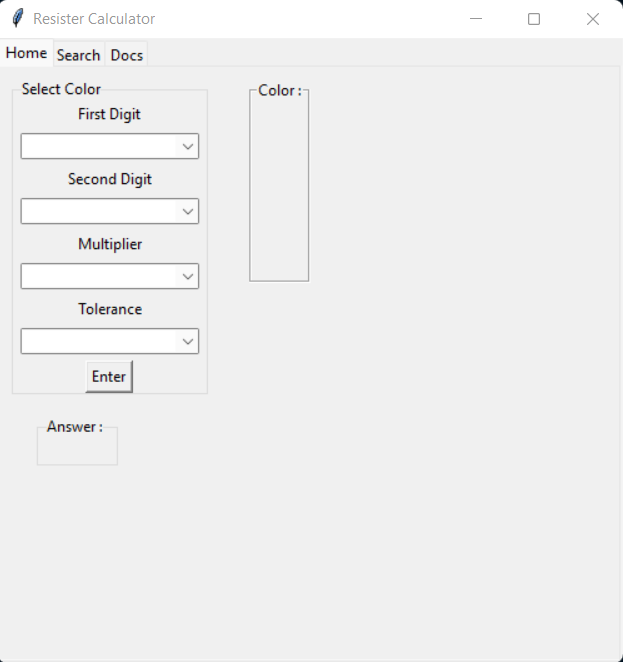
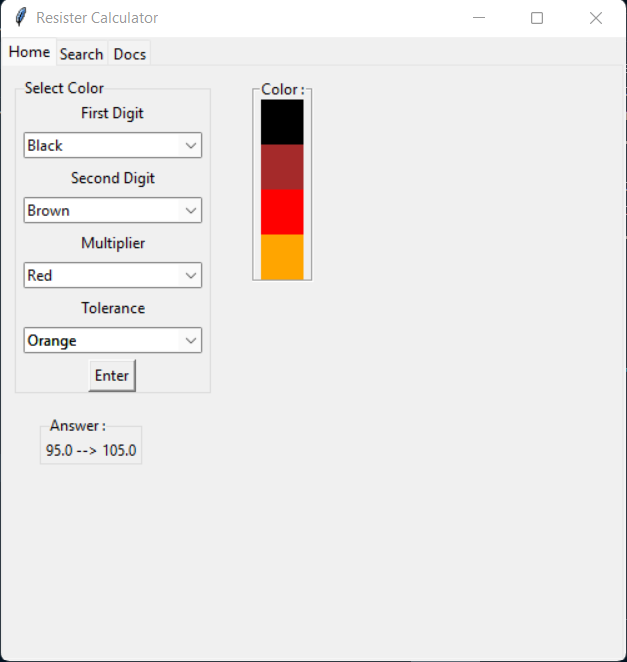

# Resister-calculator
For this project, I create this to make it easier to calculate resister (4 bands; First digit, Second digit, Multiplier digit, Tolerance digit) and easy to find usable resister on Electonic circuit

## How to use
1. Select color on window
2. Select 1st digit (No need to choose)
3. Select 2st digit
4. Select Multiplier (Must choose)
5. Select Tolerance
6. Enter Button 

## Example usgae

 

### OUTPUT
range of resister and type  of resister need ex. 0 - 1

## Next version
1. More functional
2. More usable
3. More detail
4. Fix bug and error
5. Adding Scan resister with OpenCv
